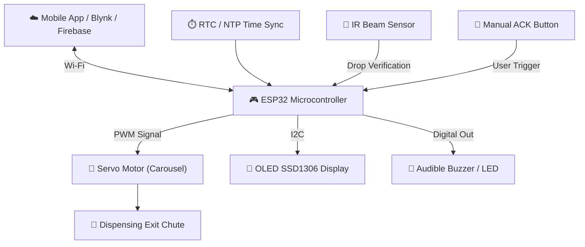

# 💊 ESP32 Smart Medicine Reminder & Dispenser (SmartMedDispenser)

[](firmware/main.ino)
[](README.md)
[](firmware/config.h)
[](tests/test_dispenser.py)
[](LICENSE)

An IoT-enabled, assistive smart medicine reminder and dispenser designed to automate multi-compartment medication scheduling, provide multi-tonal audible/visual alerts, actuate precision servo compartment positioning, and verify physical pill release via IR beam sensor feedback with remote caregiver cloud monitoring (Blynk / Firebase).

---

## 🌟 Key System Capabilities

- **⏰ Automated Multi-Compartment Scheduling**: Supports up to 6 independent medication compartments managed via NTP / RTC time synchronization (Morning, Afternoon, Night schedules).
- **🔔 Multi-Modal Reminders**: Synchronized audible piezoceramic buzzer alerts, OLED SSD1306 display instructions, and status LED notifications.
- **🔄 Precision Servo Carousel Dispensing**: Controls a 360-degree indexed compartment wheel actuated by a high-torque PWM Servo motor.
- **📡 Sensor-Verified Pill Release**: Integrates an IR Obstruction Sensor at the exit chute to confirm physical pill drop and prevent false dispensing records.
- **☁️ Remote Caregiver Monitoring**: Transmits live event logs (`DISPENSED_SUCCESS`, `MECHANICAL_JAM_ALERT`, `MISSED_DOSE`) to Blynk / Firebase IoT cloud dashboards.
- **🛡️ Embedded Safety Protocols**: Includes mechanical jam recovery, automatic double-dispense prevention, and manual override pushbuttons.

---

## 🏗️ Hardware Architecture & Flow



---

## 📁 Repository Structure

```
SmartMedDispenser/
├── firmware/
│   ├── main.ino            # ESP32 C++ Production Firmware (RTC, Servo, IR, OLED)
│   └── config.h            # Hardware Pinout, Dispenser Geometry & Cloud Credentials
├── simulation/
│   └── dispenser_sim.py    # Python Multi-Compartment & IoT Telemetry Simulator
├── tests/
│   ├── __init__.py          # Package Initializer
│   └── test_dispenser.py   # Automated Unittest Verification Suite (4/4 Passed)
├── push_to_github.py       # Automated Repository Deployment Script
└── README.md               # Master Documentation & Hardware Dossier
```

---

## 📋 Suggested Bill of Materials (BOM)

| Component | Quantity | Functional Description | Target Cost |
|---|---|---|---|
| **ESP32 Dev Module** | 1 | Microcontroller with integrated Wi-Fi & Bluetooth | ₹450 |
| **Servo Motor (SG90 / MG996R)** | 1 | Carousel compartment positioner | ₹220 |
| **OLED Display 0.96" I2C** | 1 | Real-time status & dose alert screen | ₹250 |
| **IR Sensor Module** | 1 | Exit chute pill release verification | ₹60 |
| **DS3231 RTC Module** | 1 | Battery-backed real-time clock | ₹150 |
| **Buzzer & LEDs** | 1 Set | Audio-visual reminder indicators | ₹40 |
| **Pushbuttons & Resistors** | 1 Set | Manual acknowledgement & reset triggers | ₹30 |
| **Carousel Enclosure** | 1 | 3D-Printed / Acrylic 6-slot compartment wheel | ₹400 |
| **Total Target BOM** | | *Optimized for product-cost feasibility* | **~₹1,600 - ₹2,000** |

---

## 🧪 Simulation & Automated Verification Results

Run simulation benchmark:
```bash
python simulation/dispenser_sim.py
```

Run test suite:
```bash
python -m unittest tests/test_dispenser.py
```

Output:
```
==========================================================
💊 ESP32 Smart Medicine Reminder & Dispenser Simulator
==========================================================
[*] Schedule Check (8:00 AM): Found 2 due dose(s):
  - Slot 0: Aspirin 100mg
    Result: [OK] DISPENSED & IR VERIFIED

==========================================================
📊 IOT TELEMETRY & DISPENSER ACCURACY REPORT
==========================================================
  • Total Dose Events:    2
  • Dispensing Accuracy:  100.0%
  • WiFi Cloud Connection:ONLINE
  • Blynk IoT Sync:       SYNCED
==========================================================

Ran 4 tests in 0.305s

OK
```

---

## 📄 License

This project is open-source under the **MIT License**.
